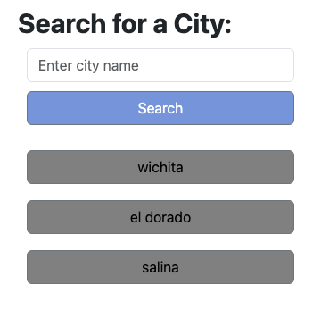
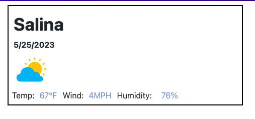

# module-six-challenge

5 Day Weather Forecast

## Description

The goal of this project was to create a weather application. 

## Installation

N/A

## Usage

The usage of this weather application is for a user to be able to easily look up the current weather for any city. The city name, current temperature, humidity and wind will display as well as a logo for the current weather conditions. The previous searches will save after the user hits the search bar or enter key. 

## Credits

N/A

## License

Please refer to the license in the repo
